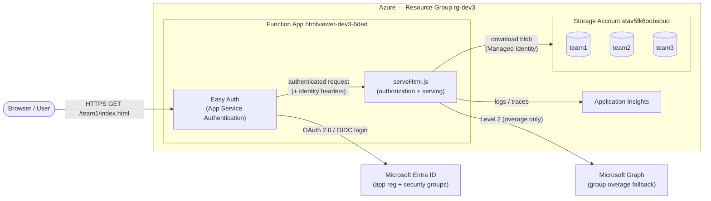
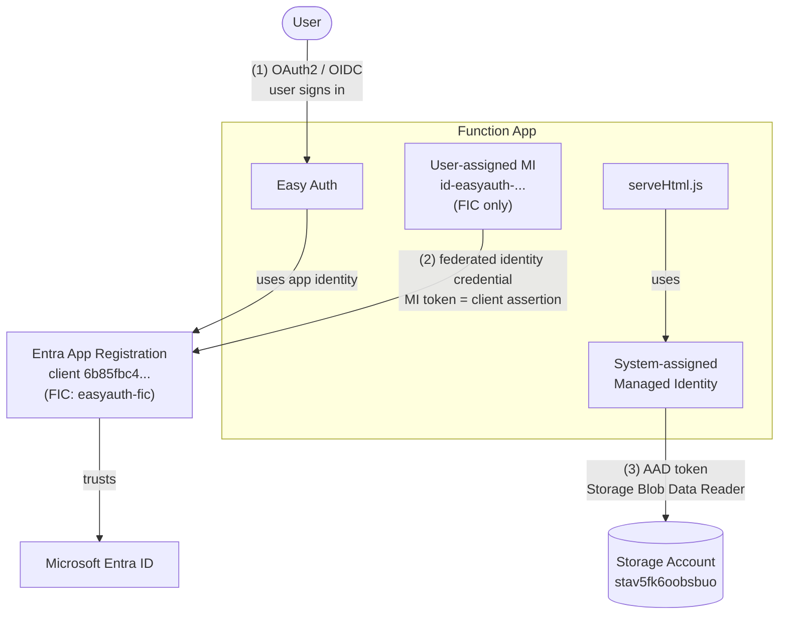
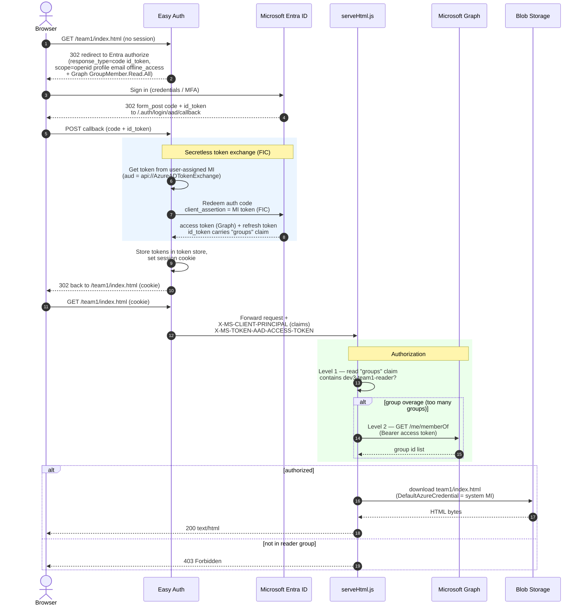
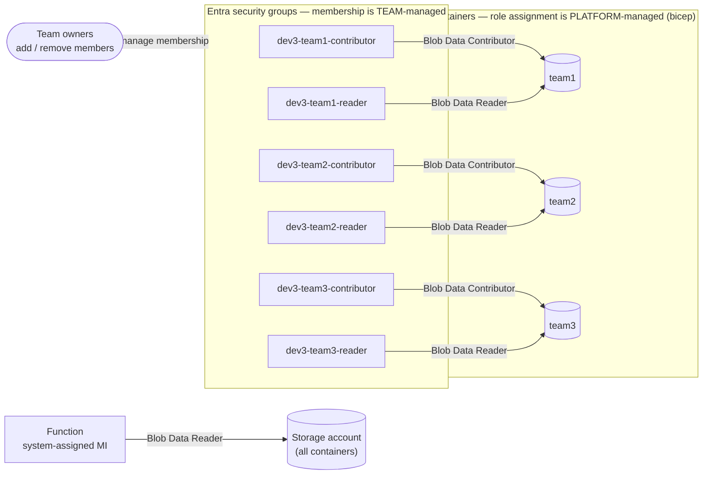

# html-upload — Secure HTML Viewer on Azure Functions

Serves HTML files from Azure Blob Storage through an Azure Function, gated by
**Microsoft Entra ID** authentication (App Service "Easy Auth") and **security-group
based authorization**. Each team has its own blob container and its own reader group;
a user only sees a team's pages if they belong to that team's reader group.

- **Function App:** `htmlviewer-dev3-6ded` (Node 20, Linux Consumption)
- **Storage:** `stav5fk6oobsbuo` with containers `team1`, `team2`, `team3`
- **URL pattern:** `https://htmlviewer-dev3-6ded.azurewebsites.net/{team}/{file}.html`
- **Infra:** Bicep under `infra/`, deployed with `azd` (`azd provision` + `azd deploy`)

Authentication is **fully secretless** — Easy Auth proves the app's identity to Entra
with a **federated identity credential (FIC)** backed by a managed identity, not a
client secret.

---

## 1. Architecture (components & request flow)



**Request path in one line:** Browser → Easy Auth (authenticates the user) →
`serveHtml.js` (authorizes by group, then reads the blob with the function's managed
identity) → HTML back to the browser.

---

## 2. Identity & authentication architecture

There are **three independent trust relationships**, none of which uses a stored secret:



| # | Relationship | How it authenticates | Secret? |
|---|--------------|----------------------|---------|
| (1) | **User ↔ Function** | Easy Auth runs the OAuth2 / OIDC authorization-code flow with Entra | — |
| (2) | **App ↔ Entra** (login token exchange) | **Federated Identity Credential**: Easy Auth gets a token from the user-assigned MI (`aud=api://AzureADTokenExchange`) and presents it as a *client assertion*; Entra trusts it via the FIC | **No secret** |
| (3) | **Function ↔ Storage** | Function code uses `DefaultAzureCredential` (system-assigned MI) to get an AAD token; the MI holds **Storage Blob Data Reader** | **No keys** |

> The user-assigned MI exists **only** to back the FIC (it has no data-plane roles).
> The system-assigned MI exists **only** to read blobs. Keeping them separate limits blast radius.

---

## 3. How a user logs in and gets the HTML page

This is the full OAuth/OIDC handshake (Easy Auth ⇄ Entra, secretless via FIC),
the group-based authorization, and the managed-identity blob read.



### 3a. User ↔ Function — OAuth 2.0 via Easy Auth

- The function code is `authLevel: "anonymous"`; **Easy Auth** sits in front and enforces
  `requireAuthentication: true` with `unauthenticatedClientAction: RedirectToLoginPage`.
- Login uses the **hybrid `code id_token`** flow with `offline_access`, so Easy Auth
  obtains a **refresh token** and can renew the Graph access token (needed for the
  Level 2 fallback) long after the ~60–90 min access-token lifetime.
- After login, Easy Auth injects identity into every request:
  - `X-MS-CLIENT-PRINCIPAL` — base64 JSON of the user's claims (including `groups`).
  - `X-MS-TOKEN-AAD-ACCESS-TOKEN` — the Graph access token (used only on overage).

### 3b. Function ↔ Storage — Managed Identity

- `getBlobContent()` uses `new DefaultAzureCredential()`, which on the Function App
  resolves to the **system-assigned managed identity**.
- That identity is granted **Storage Blob Data Reader** on the storage account, so the
  function reads blobs with an **AAD token — no account keys, no SAS** in the serving path.
- `allowBlobPublicAccess: false`; containers are private. The only way to read a page is
  through the function, after passing the group check.

---

## 4. RBAC model

Who can do what, and how the platform identities are authorized.

Two separately-owned things meet here: **who is in a group** is *team-managed*
(team owners add/remove their own members), while **which group is granted which
role on which container** is *platform-managed* (defined in bicep). Group roles are
scoped to each team's **container**, not the whole storage account.



> The user-assigned MI (`id-easyauth-...`) has **no data-plane role** — it only backs
> the EasyAuth FIC, so it's not part of this RBAC picture (see §2).

| Principal | Role / mechanism | Scope | Managed by | Purpose |
|-----------|------------------|-------|------------|---------|
| `dev3-team{n}-contributor` | Storage Blob Data **Contributor** | **`team{n}` container** | role: platform (bicep) · membership: team | Team members **upload** HTML to *their own* container |
| `dev3-team{n}-reader` | Storage Blob Data **Reader** | **`team{n}` container** | role: platform (bicep) · membership: team | Direct portal/tool browsing; **also the group the function checks** before serving |
| Function **system-assigned MI** | Storage Blob Data **Reader** | **Storage account** (all containers) | platform (bicep) | The function reads any team's blobs to serve them |
| Function **user-assigned MI** | **Federated credential** (not an Azure role) | App registration | platform (bicep) | Lets Easy Auth authenticate the app **without a secret** |

> **Container-scoped, not account-scoped.** Each team's group can only touch its own
> container — `team1-contributor` cannot write to `team2`/`team3`. Only the function's
> system-assigned MI is account-scoped, because it legitimately serves every team.

> **Two layers of authorization.** Azure RBAC (above) governs *direct* data-plane access
> (upload / browse) per container. The **function's own check** (`serveHtml.js`:
> container → `READER_GROUP_TEAM{n}`) governs *who can view a page through the app* — it
> requires membership in the matching `*-reader` group via the `groups` claim (Level 1)
> or Microsoft Graph on overage (Level 2).

> **Separation of duties.** *Membership* (who is in `team{n}-*`) is owned by each team;
> *role assignment* (which group → which container) is owned by the platform in bicep.

---

## 5. Project layout

```
infra/
  main.bicep                  # subscription-scope entry; RG + module wiring
  main.parameters.json        # azd parameter mapping
  bicepconfig.json            # declares the Microsoft Graph Bicep extension
  modules/
    ad-groups.bicep           # 6 security groups (reader/contributor x 3 teams)
    storage.bicep             # storage account, 3 containers, RBAC assignments
    function-app.bicep        # function app, Easy Auth, app reg, UAMI + FIC
    monitoring.bicep          # Log Analytics + App Insights
    role-assignment.bicep     # system MI -> Storage Blob Data Reader
src/
  host.json
  package.json
  src/functions/serveHtml.js  # authorization + blob serving
azure.yaml                    # azd service definition
```

## 6. Deploy

```bash
azd env new dev3                       # create environment
azd env set AZURE_FUNCTION_APP_NAME htmlviewer-dev3-6ded
azd provision                          # infra (RG, groups, storage, function, Easy Auth, FIC)
azd deploy                             # function code
```

Then add users to the relevant `dev3-team{n}-reader` (view) and/or
`dev3-team{n}-contributor` (upload) groups, and upload an HTML file into the team's
container. Visit `https://htmlviewer-dev3-6ded.azurewebsites.net/{team}/{file}.html`.
